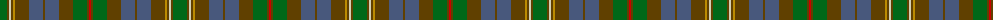

The parent of this is [Hash House Harriers Hunting](/tartans/g/14/t2/lr2/t2/dy2/t14/b14/t2/b14/t14/g14/t2/r/2/)

This was sourced from register-of-tartans.  It is a [13 stripes tartan](/stripes/stripes13/).

Original link https://www.tartanregister.gov.uk/tartanDetails.aspx?ref=5645

## Thread count
G/14 T2 LR2 T2 DY2 T14 B14 T2 B14 T14 G14 T2 R/2

## Palette
Each colour and its ΔE from the base-6 reference it is a variant of.

| Colour | Shade | Base | ΔE (OKLab) |
|---|---|---|---|
| B |  `#48587C` | B  | 0.09 |
| DR |  `#441800` | B  | 0.22 |
| DY |  `#BC8C00` | Y  | 0.16 |
| G |  `#006818` | G  | 0.02 |
| LR |  `#D4D0B4` | W  | 0.12 |
| LRa |  `#E87878` | R  | 0.19 |
| R |  `#C80000` | R  | 0.00 |
| T |  `#604000` | G  | 0.14 |

ID: /variants/g/14/t2/lr2/t2/dy2/t14/b14/t2/b14/t14/g14/t2/r/2-b48587c-dr441800-dybc8c00-g006818-lrd4d0b4-lrae87878-rc80000-t604000/
