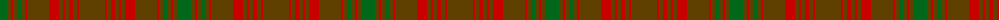

The parent of this is [Särna District Tartan Tartan Number: 2039. Earliest known date: 1783 Sarna is a town in Sweden. See products available Copyright © Blair Urquhart, Comrie, 2015](/tartans/g/14/t4/r2/t4/g4/t4/r2/t22/r10/t4/r2/t4/r4/t4/r2/t/26/)

This was sourced from house-of-tartan.  It is a [16 stripes tartan](/stripes/stripes16/).

Original link http://www.house-of-tartan.scotland.net/house/TartanViewjs.asp?colr=Def&tnam=2039

## Thread count
G/14 T4 R2 T4 G4 T4 R2 T22 R10 T4 R2 T4 R4 T4 R2 T/26

## Palette
Each colour and its ΔE from the base-6 reference it is a variant of.

| Colour | Shade | Base | ΔE (OKLab) |
|---|---|---|---|
| G |  `#006818` | G  | 0.02 |
| R |  `#C80000` | R  | 0.00 |
| T |  `#604000` | G  | 0.14 |

ID: /variants/g/14/t4/r2/t4/g4/t4/r2/t22/r10/t4/r2/t4/r4/t4/r2/t/26-g006818-rc80000-t604000/
