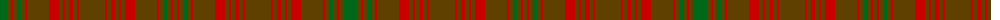

The parent of this is [Sarna (Town)](/tartans/g/14/t4/r2/t4/g4/t4/r2/t22/r10/t4/r2/t4/r4/t4/r2/t26/r2/t4/r4/t4/r2/t4/r10/t22/r2/t4/g4/t4/r2/t/4/)

This was sourced from register-of-tartans.  It is a [30 stripes tartan](/stripes/stripes30/).

Original link https://www.tartanregister.gov.uk/tartanDetails.aspx?ref=3655

## Thread count
G/14 T4 R2 T4 G4 T4 R2 T22 R10 T4 R2 T4 R4 T4 R2 T26 R2 T4 R4 T4 R2 T4 R10 T22 R2 T4 G4 T4 R2 T/4

## Palette
Each colour and its ΔE from the base-6 reference it is a variant of.

| Colour | Shade | Base | ΔE (OKLab) |
|---|---|---|---|
| G |  `#006818` | G  | 0.02 |
| R |  `#C80000` | R  | 0.00 |
| T |  `#604000` | G  | 0.14 |

ID: /variants/g/14/t4/r2/t4/g4/t4/r2/t22/r10/t4/r2/t4/r4/t4/r2/t26/r2/t4/r4/t4/r2/t4/r10/t22/r2/t4/g4/t4/r2/t/4-g006818-rc80000-t604000/
