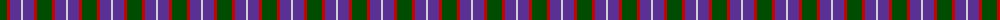

The parent of this is [MacNab WI2](/tartans/g/15/r3/p11/n/2/)

This was sourced from weddslist.  It is a [4 stripes tartan](/stripes/stripes4/).

Original link http://www.weddslist.com/cgi-bin/tartans/pg.pl?source=rb

## Thread count
G/15 R3 P11 N/2

## Palette
Each colour and its ΔE from the base-6 reference it is a variant of.

| Colour | Shade | Base | ΔE (OKLab) |
|---|---|---|---|
| G |  `#004C00` | G  | 0.08 |
| N |  `#D0D0D0` | W  | 0.11 |
| P |  `#5A3094` | B  | 0.08 |
| R |  `#C80000` | R  | 0.00 |

# Sample pattern

ID: /variants/g/15/r3/p11/n/2-g004c00-nd0d0d0-p5a3094-rc80000/
