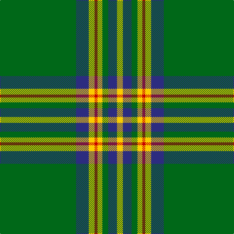

The parent of this is [Walterstrm (2014))](/tartans/g/156/db26/y12/r6/y10/g12/db18/y/12/)

This was sourced from tartans-authority.  It is a [8 stripes tartan](/stripes/stripes8/).

Original link http://www.tartansauthority.com/tartan-ferret/display/11080/

## Thread count
G/156 DB26 Y12 R6 Y10 G12 DB18 Y/12

## Palette
Each colour and its ΔE from the base-6 reference it is a variant of.

| Colour | Shade | Base | ΔE (OKLab) |
|---|---|---|---|
| DB |  `#2C2C80` | B  | 0.05 |
| G |  `#006818` | G  | 0.02 |
| R |  `#C80000` | R  | 0.00 |
| Y |  `#FCCC00` | Y  | 0.04 |

# Sample pattern

ID: /variants/g/156/db26/y12/r6/y10/g12/db18/y/12-db2c2c80-g006818-rc80000-yfccc00/
