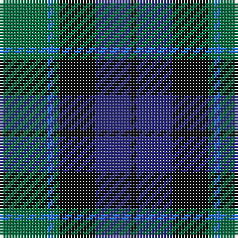

The parent of this is [Graham of Menteith](/tartans/g/16/b2/g2/k12/db12/k/2/)

This was sourced from register-of-tartans.  It is a [6 stripes tartan](/stripes/stripes6/).

Original link https://www.tartanregister.gov.uk/tartanDetails.aspx?ref=1482

## Thread count
G/16 B2 G2 K12 DB12 K/2

## Palette
Each colour and its ΔE from the base-6 reference it is a variant of.

| Colour | Shade | Base | ΔE (OKLab) |
|---|---|---|---|
| B |  `#2474E8` | B  | 0.20 |
| DB |  `#28287C` | B  | 0.06 |
| G |  `#006C3C` | G  | 0.05 |
| K |  `#101010` | K  | 0.17 |

# Sample pattern

ID: /variants/g/16/b2/g2/k12/db12/k/2-b2474e8-db28287c-g006c3c-k101010/
