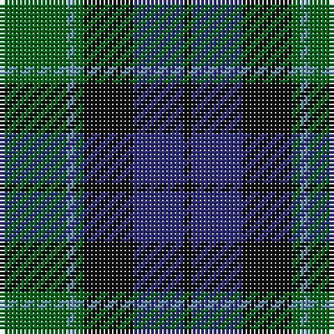

The parent of this is [Graham of Menteith (Clan)](/tartans/g/16/b2/g2/k12/db12/k/2/)

This was sourced from tartans-authority.  It is a [6 stripes tartan](/stripes/stripes6/).

Original link http://www.tartansauthority.com/tartan-ferret/display/698/

## Thread count
G/16 B2 G2 K12 DB12 K/2

## Palette
Each colour and its ΔE from the base-6 reference it is a variant of.

| Colour | Shade | Base | ΔE (OKLab) |
|---|---|---|---|
| B |  `#5C8CA8` | B  | 0.23 |
| DB |  `#2C2C80` | B  | 0.05 |
| G |  `#006818` | G  | 0.02 |
| K |  `#101010` | K  | 0.17 |

# Sample pattern

ID: /variants/g/16/b2/g2/k12/db12/k/2-b5c8ca8-db2c2c80-g006818-k101010/
