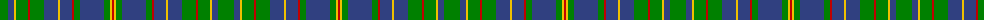

The parent of this is [Platt](/tartans/g/16/b6/y2/g12/r2/g14/b14/y2/b12/r2/g6/b24/g6/y2/r/2/)

This was sourced from weddslist.  It is a [15 stripes tartan](/stripes/stripes15/).

Original link http://www.weddslist.com/cgi-bin/tartans/pg.pl?source=sts

## Thread count
G/16 B6 Y2 G12 R2 G14 B14 Y2 B12 R2 G6 B24 G6 Y2 R/2

## Palette
Each colour and its ΔE from the base-6 reference it is a variant of.

| Colour | Shade | Base | ΔE (OKLab) |
|---|---|---|---|
| B |  `#304080` | B  | 0.01 |
| G |  `#008000` | G  | 0.09 |
| R |  `#C00000` | R  | 0.02 |
| Y |  `#F0C000` | Y  | 0.01 |

ID: /variants/g/16/b6/y2/g12/r2/g14/b14/y2/b12/r2/g6/b24/g6/y2/r/2-b304080-g008000-rc00000-yf0c000/
