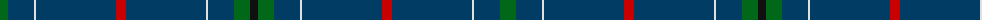

The parent of this is [London Scottish Rugby Club Corporate Sport Tartan Tartan Number: 2360. Earliest known date: May 1998 For the use of staff and club members. Blue should be almost blue/black. See products available Copyright © Blair Urquhart, Comrie, 2015](/tartans/g/16/db26/ln2/db80/r10/db80/ln2/db26/g16/k/8/)

This was sourced from house-of-tartan.  It is a [10 stripes tartan](/stripes/stripes10/).

Original link http://www.house-of-tartan.scotland.net/house/TartanViewjs.asp?colr=Def&tnam=2360

## Thread count
G/16 DB26 LN2 DB80 R10 DB80 LN2 DB26 G16 K/8

## Palette
Each colour and its ΔE from the base-6 reference it is a variant of.

| Colour | Shade | Base | ΔE (OKLab) |
|---|---|---|---|
| DB |  `#003C64` | B  | 0.07 |
| G |  `#006818` | G  | 0.02 |
| K |  `#101010` | K  | 0.17 |
| LN |  `#E0E0E0` | W  | 0.06 |
| R |  `#C80000` | R  | 0.00 |

ID: /variants/g/16/db26/ln2/db80/r10/db80/ln2/db26/g16/k/8-db003c64-g006818-k101010-lne0e0e0-rc80000/
