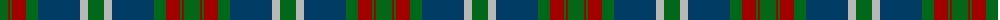

The parent of this is [Cathcart (Artefact)](/tartans/g/16/dr2/g2/dr14/g12/db42/n8/g/16/)

This was sourced from tartans-authority.  It is a [8 stripes tartan](/stripes/stripes8/).

Original link http://www.tartansauthority.com/tartan-ferret/display/4479/

## Thread count
G/16 DR2 G2 DR14 G12 DB42 N8 G/16

## Palette
Each colour and its ΔE from the base-6 reference it is a variant of.

| Colour | Shade | Base | ΔE (OKLab) |
|---|---|---|---|
| DB |  `#003C64` | B  | 0.07 |
| DR |  `#A00000` | R  | 0.09 |
| G |  `#006818` | G  | 0.02 |
| N |  `#B8B8B8` | Y  | 0.17 |

# Sample pattern

ID: /variants/g/16/dr2/g2/dr14/g12/db42/n8/g/16-db003c64-dra00000-g006818-nb8b8b8/
