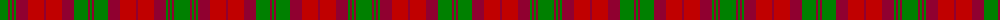

The parent of this is [MacNab 3](/tartans/g/16/dr2/g2/dr2/g2/dr12/r16/dr2/r16/dr12/g14/dr2/g/2/)

This was sourced from weddslist.  It is a [13 stripes tartan](/stripes/stripes13/).

Original link http://www.weddslist.com/cgi-bin/tartans/pg.pl?source=sts

## Thread count
G/16 DR2 G2 DR2 G2 DR12 R16 DR2 R16 DR12 G14 DR2 G/2

## Palette
Each colour and its ΔE from the base-6 reference it is a variant of.

| Colour | Shade | Base | ΔE (OKLab) |
|---|---|---|---|
| DR |  `#900030` | R  | 0.13 |
| G |  `#008000` | G  | 0.09 |
| R |  `#C00000` | R  | 0.02 |

ID: /variants/g/16/dr2/g2/dr2/g2/dr12/r16/dr2/r16/dr12/g14/dr2/g/2-dr900030-g008000-rc00000/
