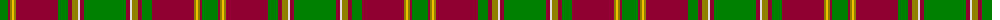

The parent of this is [Glendronach](/tartans/g/16/dr2/lg2/y2/lg2/dr42/g10/dr4/lg6/ln2/dr4/g/42/)

This was sourced from weddslist.  It is a [12 stripes tartan](/stripes/stripes12/).

Original link http://www.weddslist.com/cgi-bin/tartans/pg.pl?source=sts

## Thread count
G/16 DR2 LG2 Y2 LG2 DR42 G10 DR4 LG6 LN2 DR4 G/42

## Palette
Each colour and its ΔE from the base-6 reference it is a variant of.

| Colour | Shade | Base | ΔE (OKLab) |
|---|---|---|---|
| DR |  `#900030` | R  | 0.13 |
| G |  `#008000` | G  | 0.09 |
| LG |  `#908000` | G  | 0.19 |
| LN |  `#E0E0E0` | W  | 0.06 |
| Y |  `#F0C000` | Y  | 0.01 |

ID: /variants/g/16/dr2/lg2/y2/lg2/dr42/g10/dr4/lg6/ln2/dr4/g/42-dr900030-g008000-lg908000-lne0e0e0-yf0c000/
