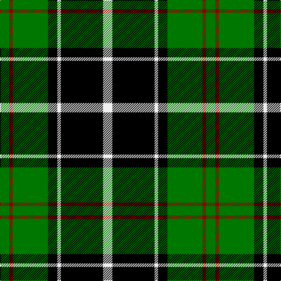

The parent of this is [Cleghorn (Personal)](/tartans/g/16/dr6/g60/k16/w6/k72/w/16/)

This was sourced from tartans-authority.  It is a [7 stripes tartan](/stripes/stripes7/).

Original link http://www.tartansauthority.com/tartan-ferret/display/4144/

## Thread count
G/16 DR6 G60 K16 W6 K72 W/16

## Palette
Each colour and its ΔE from the base-6 reference it is a variant of.

| Colour | Shade | Base | ΔE (OKLab) |
|---|---|---|---|
| DR |  `#8C0000` | R  | 0.13 |
| G |  `#007800` | G  | 0.06 |
| K |  `#000000` | K  | 0.00 |
| W |  `#F0F0F0` | W  | 0.01 |

# Sample pattern

ID: /variants/g/16/dr6/g60/k16/w6/k72/w/16-dr8c0000-g007800-k000000-wf0f0f0/
