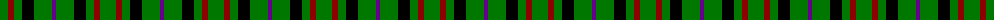

The parent of this is [Milton (Name?)](/tartans/g/16/dr6/g8/k12/g18/p/4/)

This was sourced from tartans-authority.  It is a [6 stripes tartan](/stripes/stripes6/).

Original link http://www.tartansauthority.com/tartan-ferret/display/4176/

## Thread count
G/16 DR6 G8 K12 G18 P/4

## Palette
Each colour and its ΔE from the base-6 reference it is a variant of.

| Colour | Shade | Base | ΔE (OKLab) |
|---|---|---|---|
| DR |  `#8C0000` | R  | 0.13 |
| G |  `#007800` | G  | 0.06 |
| K |  `#000000` | K  | 0.00 |
| P |  `#64008C` | B  | 0.13 |

# Sample pattern

ID: /variants/g/16/dr6/g8/k12/g18/p/4-dr8c0000-g007800-k000000-p64008c/
