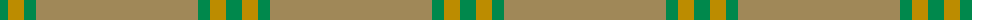

The parent of this is [Young in Australia (Name)](/tartans/g/16/dy16/g12/lt/162/)

This was sourced from tartans-authority.  It is a [4 stripes tartan](/stripes/stripes4/).

Original link http://www.tartansauthority.com/tartan-ferret/display/10241/

## Thread count
G/16 DY16 G12 LT/162

## Palette
Each colour and its ΔE from the base-6 reference it is a variant of.

| Colour | Shade | Base | ΔE (OKLab) |
|---|---|---|---|
| DY |  `#BC8C00` | Y  | 0.16 |
| G |  `#00884C` | G  | 0.12 |
| LT |  `#A08858` | Y  | 0.21 |

# Sample pattern

ID: /variants/g/16/dy16/g12/lt/162-dybc8c00-g00884c-lta08858/
