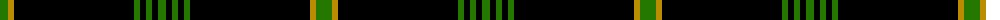
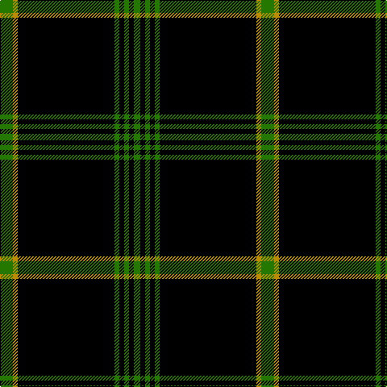

The parent of this is [Aberdeen-Angus Cattle Society (Corp)](/tartans/g/16/dy6/k120/g6/k6/g6/k6/g/8/)

This was sourced from tartans-authority.  It is a [8 stripes tartan](/stripes/stripes8/).

Original link http://www.tartansauthority.com/tartan-ferret/display/3012/

## Thread count
G/16 DY6 K120 G6 K6 G6 K6 G/8

## Palette
Each colour and its ΔE from the base-6 reference it is a variant of.

| Colour | Shade | Base | ΔE (OKLab) |
|---|---|---|---|
| DY |  `#BC8C00` | Y  | 0.16 |
| G |  `#247800` | G  | 0.07 |
| K |  `#000000` | K  | 0.00 |

# Sample pattern

ID: /variants/g/16/dy6/k120/g6/k6/g6/k6/g/8-dybc8c00-g247800-k000000/
