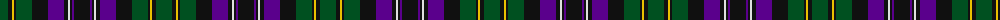

The parent of this is [Unidentified #32](/tartans/g/16/k4/y2/k2/g16/k16/p16/k4/ln2/k2/p2/k/16/)

This was sourced from register-of-tartans.  It is a [12 stripes tartan](/stripes/stripes12/).

Original link https://www.tartanregister.gov.uk/tartanDetails.aspx?ref=4233

## Thread count
G/16 K4 Y2 K2 G16 K16 P16 K4 LN2 K2 P2 K/16

## Palette
Each colour and its ΔE from the base-6 reference it is a variant of.

| Colour | Shade | Base | ΔE (OKLab) |
|---|---|---|---|
| G |  `#005020` | G  | 0.08 |
| K |  `#101010` | K  | 0.17 |
| LN |  `#E0E0E0` | W  | 0.06 |
| P |  `#5A008C` | B  | 0.12 |
| Y |  `#E8C000` | Y  | 0.00 |

ID: /variants/g/16/k4/y2/k2/g16/k16/p16/k4/ln2/k2/p2/k/16-g005020-k101010-lne0e0e0-p5a008c-ye8c000/
