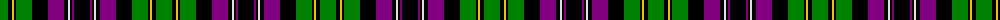

The parent of this is [Unnamed 10](/tartans/g/16/k4/y2/k2/g16/k16/p16/k4/ln2/k2/p2/k/16/)

This was sourced from weddslist.  It is a [12 stripes tartan](/stripes/stripes12/).

Original link http://www.weddslist.com/cgi-bin/tartans/pg.pl?source=sts

## Thread count
G/16 K4 Y2 K2 G16 K16 P16 K4 LN2 K2 P2 K/16

## Palette
Each colour and its ΔE from the base-6 reference it is a variant of.

| Colour | Shade | Base | ΔE (OKLab) |
|---|---|---|---|
| G |  `#008000` | G  | 0.09 |
| K |  `#000000` | K  | 0.00 |
| LN |  `#E0E0E0` | W  | 0.06 |
| P |  `#800080` | B  | 0.17 |
| Y |  `#F0C000` | Y  | 0.01 |

ID: /variants/g/16/k4/y2/k2/g16/k16/p16/k4/ln2/k2/p2/k/16-g008000-k000000-lne0e0e0-p800080-yf0c000/
