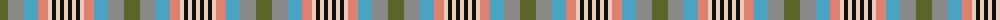

The parent of this is [Somerset (District)](/tartans/g/16/n16/b14/lr10/lra4/k4/lra4/k4/lra/4/)

This was sourced from tartans-authority.  It is a [9 stripes tartan](/stripes/stripes9/).

Original link http://www.tartansauthority.com/tartan-ferret/display/831/

## Thread count
G/16 N16 B14 LR10 LRa4 K4 LRa4 K4 LRa/4

## Palette
Each colour and its ΔE from the base-6 reference it is a variant of.

| Colour | Shade | Base | ΔE (OKLab) |
|---|---|---|---|
| B |  `#48A4C0` | Y  | 0.28 |
| G |  `#5C6428` | G  | 0.09 |
| K |  `#101010` | K  | 0.17 |
| LR |  `#E08070` | Y  | 0.20 |
| LRa |  `#E8CCB8` | W  | 0.11 |
| N |  `#888888` | R  | 0.24 |

ID: /variants/g/16/n16/b14/lr10/lra4/k4/lra4/k4/lra/4-b48a4c0-g5c6428-k101010-lre08070-lrae8ccb8-n888888/
