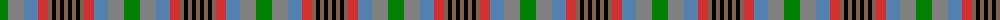

The parent of this is [Somerset](/tartans/g/16/n16/b14/r10/lt4/k4/lt4/k4/lt/4/)

This was sourced from weddslist.  It is a [9 stripes tartan](/stripes/stripes9/).

Original link http://www.weddslist.com/cgi-bin/tartans/pg.pl?source=sts

## Thread count
G/16 N16 B14 R10 LT4 K4 LT4 K4 LT/4

## Palette
Each colour and its ΔE from the base-6 reference it is a variant of.

| Colour | Shade | Base | ΔE (OKLab) |
|---|---|---|---|
| B |  `#5480B0` | B  | 0.20 |
| G |  `#008000` | G  | 0.09 |
| K |  `#000000` | K  | 0.00 |
| LT |  `#806050` | R  | 0.17 |
| N |  `#808080` | G  | 0.22 |
| R |  `#D03030` | R  | 0.05 |

ID: /variants/g/16/n16/b14/r10/lt4/k4/lt4/k4/lt/4-b5480b0-g008000-k000000-lt806050-n808080-rd03030/
