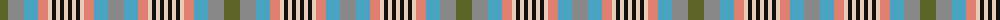

The parent of this is [Somerset](/tartans/g/16/n16/bb14/lr10/lra4/k4/lra4/k4/lra4/k4/lra4/k4/lra4/lr10/bb14/n/16/)

This was sourced from register-of-tartans.  It is a [16 stripes tartan](/stripes/stripes16/).

Original link https://www.tartanregister.gov.uk/tartanDetails.aspx?ref=3833

## Thread count
G/16 N16 Bb14 LR10 LRa4 K4 LRa4 K4 LRa4 K4 LRa4 K4 LRa4 LR10 Bb14 N/16

## Palette
Each colour and its ΔE from the base-6 reference it is a variant of.

| Colour | Shade | Base | ΔE (OKLab) |
|---|---|---|---|
| B |  `#5C8CA8` | B  | 0.23 |
| Ba |  `#2888C4` | B  | 0.21 |
| Bb |  `#48A4C0` | Y  | 0.28 |
| G |  `#5C6428` | G  | 0.09 |
| K |  `#101010` | K  | 0.17 |
| LG |  `#C4BC68` | Y  | 0.07 |
| LR |  `#E08070` | Y  | 0.20 |
| LRa |  `#E8CCB8` | W  | 0.11 |
| N |  `#888888` | R  | 0.24 |

ID: /variants/g/16/n16/bb14/lr10/lra4/k4/lra4/k4/lra4/k4/lra4/k4/lra4/lr10/bb14/n/16-b5c8ca8-ba2888c4-bb48a4c0-g5c6428-k101010-lgc4bc68-lre08070-lrae8ccb8-n888888/
