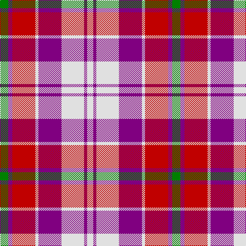

The parent of this is [Culloden, Red (dress)](/tartans/g/16/p8/r45/ln6/p45/ln44/p6/ln/12/)

This was sourced from weddslist.  It is a [8 stripes tartan](/stripes/stripes8/).

Original link http://www.weddslist.com/cgi-bin/tartans/pg.pl?source=sts

## Thread count
G/16 P8 R45 LN6 P45 LN44 P6 LN/12

## Palette
Each colour and its ΔE from the base-6 reference it is a variant of.

| Colour | Shade | Base | ΔE (OKLab) |
|---|---|---|---|
| G |  `#008000` | G  | 0.09 |
| LN |  `#E0E0E0` | W  | 0.06 |
| P |  `#800080` | B  | 0.17 |
| R |  `#C00000` | R  | 0.02 |

# Sample pattern

ID: /variants/g/16/p8/r45/ln6/p45/ln44/p6/ln/12-g008000-lne0e0e0-p800080-rc00000/
