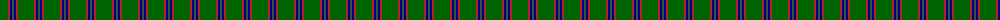
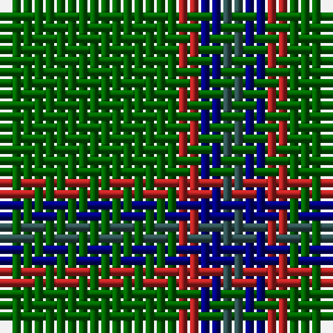

The parent of this is [Jodi Williams (Personal)](/tartans/g/16/r2/db2/n/2/)

This was sourced from register-of-tartans.  It is a [4 stripes tartan](/stripes/stripes4/).

Original link https://www.tartanregister.gov.uk/tartanDetails.aspx?ref=10110

## Thread count
G/16 R2 DB2 N/2

## Palette
Each colour and its ΔE from the base-6 reference it is a variant of.

| Colour | Shade | Base | ΔE (OKLab) |
|---|---|---|---|
| DB |  `#000080` | B  | 0.14 |
| G |  `#006400` | G  | 0.00 |
| N |  `#2F4F4F` | B  | 0.11 |
| R |  `#B22222` | R  | 0.04 |

# Sample pattern

ID: /variants/g/16/r2/db2/n/2-db000080-g006400-n2f4f4f-rb22222/
