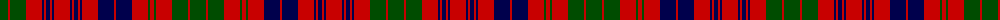

The parent of this is [Ross](/tartans/g/16/r2/g16/r16/db2/r2/db4/r2/db2/r16/db2/r2/db4/r2/db2/r16/db16/r2/db16/r16/g2/r4/g2/r16/g16/r2/g/16/)

This was sourced from weddslist.  It is a [27 stripes tartan](/stripes/stripes27/).

Original link http://www.weddslist.com/cgi-bin/tartans/pg.pl?source=rb

## Thread count
G/16 R2 G16 R16 DB2 R2 DB4 R2 DB2 R16 DB2 R2 DB4 R2 DB2 R16 DB16 R2 DB16 R16 G2 R4 G2 R16 G16 R2 G/16

## Palette
Each colour and its ΔE from the base-6 reference it is a variant of.

| Colour | Shade | Base | ΔE (OKLab) |
|---|---|---|---|
| DB |  `#00004C` | B  | 0.21 |
| G |  `#004C00` | G  | 0.08 |
| R |  `#C80000` | R  | 0.00 |

ID: /variants/g/16/r2/g16/r16/db2/r2/db4/r2/db2/r16/db2/r2/db4/r2/db2/r16/db16/r2/db16/r16/g2/r4/g2/r16/g16/r2/g/16-db00004c-g004c00-rc80000/
