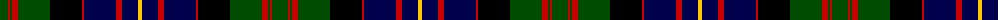

The parent of this is [Cameron of Erracht](/tartans/g/16/r2/g2/r6/g32/k32/r2/db32/r6/db16/y/4/)

This was sourced from weddslist.  It is a [11 stripes tartan](/stripes/stripes11/).

Original link http://www.weddslist.com/cgi-bin/tartans/pg.pl?source=rb

## Thread count
G/16 R2 G2 R6 G32 K32 R2 DB32 R6 DB16 Y/4

## Palette
Each colour and its ΔE from the base-6 reference it is a variant of.

| Colour | Shade | Base | ΔE (OKLab) |
|---|---|---|---|
| DB |  `#00004C` | B  | 0.21 |
| G |  `#004C00` | G  | 0.08 |
| K |  `#000000` | K  | 0.00 |
| R |  `#C80000` | R  | 0.00 |
| Y |  `#FFC800` | Y  | 0.04 |

ID: /variants/g/16/r2/g2/r6/g32/k32/r2/db32/r6/db16/y/4-db00004c-g004c00-k000000-rc80000-yffc800/
