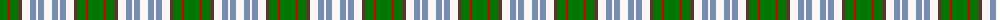

The parent of this is [Gaelic College of St.Anns (Corporate](/tartans/g/16/r2/g8/t4/w8/b6/w2/b6/w/8/)

This was sourced from tartans-authority.  It is a [9 stripes tartan](/stripes/stripes9/).

Original link http://www.tartansauthority.com/tartan-ferret/display/4942/

## Thread count
G/16 R2 G8 T4 W8 B6 W2 B6 W/8

## Palette
Each colour and its ΔE from the base-6 reference it is a variant of.

| Colour | Shade | Base | ΔE (OKLab) |
|---|---|---|---|
| B |  `#788CB4` | B  | 0.25 |
| G |  `#007800` | G  | 0.06 |
| R |  `#C80000` | R  | 0.00 |
| T |  `#503C28` | G  | 0.16 |
| W |  `#F8F8F8` | W  | 0.01 |

ID: /variants/g/16/r2/g8/t4/w8/b6/w2/b6/w/8-b788cb4-g007800-rc80000-t503c28-wf8f8f8/
