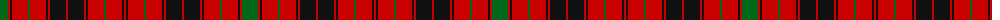

The parent of this is [Hebrides South Uist #3](/tartans/g/16/r2/k2/r16/g2/r16/k2/r2/k16/r2/k16/r2/k2/r16/g2/r16/k2/r/2/)

This was sourced from register-of-tartans.  It is a [18 stripes tartan](/stripes/stripes18/).

Original link https://www.tartanregister.gov.uk/tartanDetails.aspx?ref=1670

## Thread count
G/16 R2 K2 R16 G2 R16 K2 R2 K16 R2 K16 R2 K2 R16 G2 R16 K2 R/2

## Palette
Each colour and its ΔE from the base-6 reference it is a variant of.

| Colour | Shade | Base | ΔE (OKLab) |
|---|---|---|---|
| G |  `#006818` | G  | 0.02 |
| K |  `#101010` | K  | 0.17 |
| R |  `#C80000` | R  | 0.00 |

ID: /variants/g/16/r2/k2/r16/g2/r16/k2/r2/k16/r2/k16/r2/k2/r16/g2/r16/k2/r/2-g006818-k101010-rc80000/
