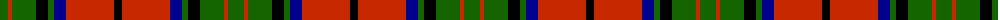

The parent of this is [Dickie (Name)](/tartans/g/16/r4/g24/k12/g6/db12/r48/k/8/)

This was sourced from tartans-authority.  It is a [8 stripes tartan](/stripes/stripes8/).

Original link http://www.tartansauthority.com/tartan-ferret/display/4192/

## Thread count
G/16 R4 G24 K12 G6 DB12 R48 K/8

## Palette
Each colour and its ΔE from the base-6 reference it is a variant of.

| Colour | Shade | Base | ΔE (OKLab) |
|---|---|---|---|
| DB |  `#00008C` | B  | 0.13 |
| G |  `#146400` | G  | 0.01 |
| K |  `#000000` | K  | 0.00 |
| R |  `#C82800` | R  | 0.03 |

# Sample pattern

ID: /variants/g/16/r4/g24/k12/g6/db12/r48/k/8-db00008c-g146400-k000000-rc82800/
