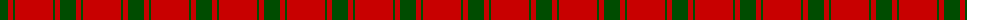

The parent of this is [MacDonald Lord of the Isles](/tartans/g/16/r5/g2/r/38/)

This was sourced from weddslist.  It is a [4 stripes tartan](/stripes/stripes4/).

Original link http://www.weddslist.com/cgi-bin/tartans/pg.pl?source=rb

## Thread count
G/16 R5 G2 R/38

## Palette
Each colour and its ΔE from the base-6 reference it is a variant of.

| Colour | Shade | Base | ΔE (OKLab) |
|---|---|---|---|
| G |  `#004C00` | G  | 0.08 |
| R |  `#C80000` | R  | 0.00 |

# Sample pattern

ID: /variants/g/16/r5/g2/r/38-g004c00-rc80000/
