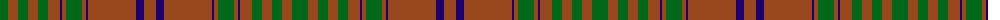

The parent of this is [MacGillivray Htg (Clan)](/tartans/g/16/t10/g10/t10/g10/t12/db2/t4/g16/t4/db2/t48/db8/t/12/)

This was sourced from tartans-authority.  It is a [14 stripes tartan](/stripes/stripes14/).

Original link http://www.tartansauthority.com/tartan-ferret/display/3371/

## Thread count
G/16 T10 G10 T10 G10 T12 DB2 T4 G16 T4 DB2 T48 DB8 T/12

## Palette
Each colour and its ΔE from the base-6 reference it is a variant of.

| Colour | Shade | Base | ΔE (OKLab) |
|---|---|---|---|
| DB |  `#1C0070` | B  | 0.14 |
| G |  `#006818` | G  | 0.02 |
| T |  `#98481C` | R  | 0.11 |

ID: /variants/g/16/t10/g10/t10/g10/t12/db2/t4/g16/t4/db2/t48/db8/t/12-db1c0070-g006818-t98481c/
