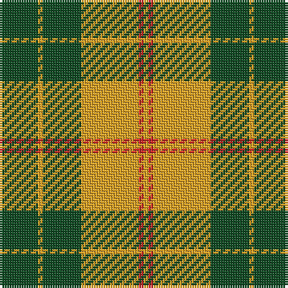

The parent of this is [Forget Family (Yonne) Name Tartan Tartan Number: 10694. Earliest known date: 11 September 2012 The gold and red colours in the tartan are the Forget family colours, with green to recall the importance of the forest for the family. See products available Copyright © Blair Urquhart, Comrie, 2015](/tartans/g/16/y2/g16/y24/r2/y/2/)

This was sourced from house-of-tartan.  It is a [6 stripes tartan](/stripes/stripes6/).

Original link http://www.house-of-tartan.scotland.net/house/TartanViewjs.asp?colr=Def&tnam=10694

## Thread count
G/16 Y2 G16 Y24 R2 Y/2

## Palette
Each colour and its ΔE from the base-6 reference it is a variant of.

| Colour | Shade | Base | ΔE (OKLab) |
|---|---|---|---|
| G |  `#124B24` | G  | 0.09 |
| R |  `#CA2625` | R  | 0.03 |
| Y |  `#E0A126` | Y  | 0.08 |

# Sample pattern

ID: /variants/g/16/y2/g16/y24/r2/y/2-g124b24-rca2625-ye0a126/
