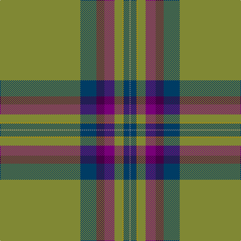

The parent of this is [Heather Isle Weavers Tartan Tartan Number: 6902. Earliest known date: 2006 Designed in September 2005 for Lochcarron's new range and woven in several different qualities for kilts, ladies' skirts and scarves. The original count from Lochcarron stipulated light blue in place of this green but the woven sample used green so the count has been changed. It may be that the green version is meant to be 'weathered.' See products available Copyright © Blair Urquhart, Comrie, 2015](/tartans/g/160/db32/dp16/p20/g16/dy2/db12/n/2/)

This was sourced from house-of-tartan.  It is a [8 stripes tartan](/stripes/stripes8/).

Original link http://www.house-of-tartan.scotland.net/house/TartanViewjs.asp?colr=Def&tnam=6902

## Thread count
G/160 DB32 DP16 P20 G16 DY2 DB12 N/2

## Palette
Each colour and its ΔE from the base-6 reference it is a variant of.

| Colour | Shade | Base | ΔE (OKLab) |
|---|---|---|---|
| B |  `#2888C4` | B  | 0.21 |
| DB |  `#003C64` | B  | 0.07 |
| DP |  `#440044` | B  | 0.17 |
| DY |  `#BC8C00` | Y  | 0.16 |
| G |  `#808834` | G  | 0.18 |
| N |  `#888888` | R  | 0.24 |
| P |  `#780078` | B  | 0.16 |

# Sample pattern

ID: /variants/g/160/db32/dp16/p20/g16/dy2/db12/n/2-b2888c4-db003c64-dp440044-dybc8c00-g808834-n888888-p780078/
