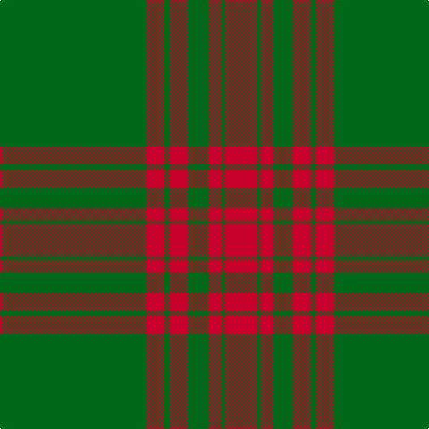

The parent of this is [Aukland & District Pipe Band (Corp)](/tartans/g/164/r20/g6/r20/g23/r14/g4/r/36/)

This was sourced from tartans-authority.  It is a [8 stripes tartan](/stripes/stripes8/).

Original link http://www.tartansauthority.com/tartan-ferret/display/8268/

## Thread count
G/164 R20 G6 R20 G23 R14 G4 R/36

## Palette
Each colour and its ΔE from the base-6 reference it is a variant of.

| Colour | Shade | Base | ΔE (OKLab) |
|---|---|---|---|
| G |  `#006818` | G  | 0.02 |
| R |  `#C8002C` | R  | 0.03 |

# Sample pattern

ID: /variants/g/164/r20/g6/r20/g23/r14/g4/r/36-g006818-rc8002c/
