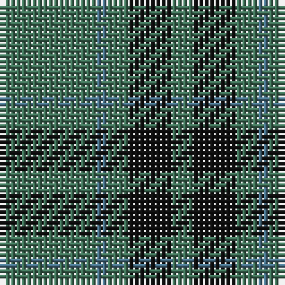

The parent of this is [Peterhead (Fashion)](/tartans/g/18/b2/g4/k8/g/4/)

This was sourced from tartans-authority.  It is a [5 stripes tartan](/stripes/stripes5/).

Original link http://www.tartansauthority.com/tartan-ferret/display/2368/

## Thread count
G/18 B2 G4 K8 G/4

## Palette
Each colour and its ΔE from the base-6 reference it is a variant of.

| Colour | Shade | Base | ΔE (OKLab) |
|---|---|---|---|
| B |  `#487088` | B  | 0.15 |
| G |  `#407058` | G  | 0.11 |
| K |  `#101010` | K  | 0.17 |

# Sample pattern

ID: /variants/g/18/b2/g4/k8/g/4-b487088-g407058-k101010/
