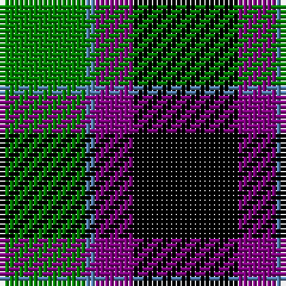

The parent of this is [Wilson's, No 228](/tartans/g/18/b2/p8/k/22/)

This was sourced from weddslist.  It is a [4 stripes tartan](/stripes/stripes4/).

Original link http://www.weddslist.com/cgi-bin/tartans/pg.pl?source=sts

## Thread count
G/18 B2 P8 K/22

## Palette
Each colour and its ΔE from the base-6 reference it is a variant of.

| Colour | Shade | Base | ΔE (OKLab) |
|---|---|---|---|
| B |  `#5480B0` | B  | 0.20 |
| G |  `#008000` | G  | 0.09 |
| K |  `#000000` | K  | 0.00 |
| P |  `#800080` | B  | 0.17 |

# Sample pattern

ID: /variants/g/18/b2/p8/k/22-b5480b0-g008000-k000000-p800080/
