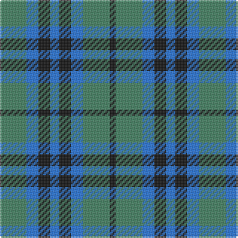

The parent of this is [Keith Clan](/tartans/g/18/b8/k8/b6/k8/b8/g18/k/4/)

This was sourced from register-of-tartans.  It is a [8 stripes tartan](/stripes/stripes8/).

Original link https://www.tartanregister.gov.uk/tartanDetails.aspx?ref=1936

## Thread count
G/18 B8 K8 B6 K8 B8 G18 K/4

## Palette
Each colour and its ΔE from the base-6 reference it is a variant of.

| Colour | Shade | Base | ΔE (OKLab) |
|---|---|---|---|
| B |  `#2474E8` | B  | 0.20 |
| DB |  `#003C64` | B  | 0.07 |
| DN |  `#14283C` | B  | 0.14 |
| G |  `#408060` | G  | 0.13 |
| Ga |  `#005448` | G  | 0.11 |
| K |  `#101010` | K  | 0.17 |

# Sample pattern

ID: /variants/g/18/b8/k8/b6/k8/b8/g18/k/4-b2474e8-db003c64-dn14283c-g408060-ga005448-k101010/
