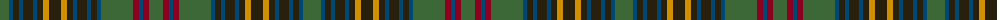

The parent of this is [Limerick Irish County Tartan Tartan Number: 2272. Earliest known date: 1996 One of a series of Irish District tartans designed by Polly Wittering of the House of Edgar, with colours reminiscent of the Country with soft warm colours dominating. See products available Copyright © Blair Urquhart, Comrie, 2015](/tartans/g/18/db4/k6/db4/k10/db4/k6/dy6/k12/dy6/k6/db4/k10/db4/k6/db4/g32/dr6/db4/dr6/g/14/)

This was sourced from house-of-tartan.  It is a [21 stripes tartan](/stripes/stripes21/).

Original link http://www.house-of-tartan.scotland.net/house/TartanViewjs.asp?colr=Def&tnam=2272

## Thread count
G/18 DB4 K6 DB4 K10 DB4 K6 DY6 K12 DY6 K6 DB4 K10 DB4 K6 DB4 G32 DR6 DB4 DR6 G/14

## Palette
Each colour and its ΔE from the base-6 reference it is a variant of.

| Colour | Shade | Base | ΔE (OKLab) |
|---|---|---|---|
| DB |  `#004874` | B  | 0.05 |
| DR |  `#8C0020` | R  | 0.13 |
| DY |  `#D09000` | Y  | 0.13 |
| G |  `#3C6838` | G  | 0.07 |
| K |  `#28200C` | B  | 0.21 |

ID: /variants/g/18/db4/k6/db4/k10/db4/k6/dy6/k12/dy6/k6/db4/k10/db4/k6/db4/g32/dr6/db4/dr6/g/14-db004874-dr8c0020-dyd09000-g3c6838-k28200c/
