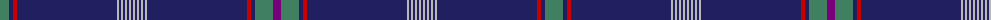

The parent of this is [G8 Summit Corporate Tartan Tartan Number: 6490. Earliest known date: 2004 December Designed on behalf of the Scottish Tartans Authority for a G8 tartan to mark the 2005 G8 Summit hosted by Scotland at Gleneagles Hotel in Perthshire. The Green and Purple represent the 2005 G8 Summit thistle-logo and red is the one colour present in all the G8 nation flags - the common thread that binds them together in their efforts to aid underdeveloped countries. There is one white line for each G8 nation which, together on the dark blue, form the white cross of St Andrew - the flag of the host nation. An independent panel of judges chose what they considered to be the best three designs which were then sent to No. 10 Downing Street where Mrs Cherie Blair (the wife of the British Prime Minister) made the final choice. See products available Copyright © Blair Urquhart, Comrie, 2015](/tartans/g/18/db4/r4/db100/n2/db2/n2/db2/n2/db2/n2/db2/n2/db2/n2/db2/n2/db2/n2/db100/r4/db4/g18/p/8/)

This was sourced from house-of-tartan.  It is a [24 stripes tartan](/stripes/stripes24/).

Original link http://www.house-of-tartan.scotland.net/house/TartanViewjs.asp?colr=Def&tnam=6490

## Thread count
G/18 DB4 R4 DB100 N2 DB2 N2 DB2 N2 DB2 N2 DB2 N2 DB2 N2 DB2 N2 DB2 N2 DB100 R4 DB4 G18 P/8

## Palette
Each colour and its ΔE from the base-6 reference it is a variant of.

| Colour | Shade | Base | ΔE (OKLab) |
|---|---|---|---|
| DB |  `#202060` | B  | 0.11 |
| DR |  `#880000` | R  | 0.14 |
| G |  `#408060` | G  | 0.13 |
| LN |  `#E0E0E0` | W  | 0.06 |
| N |  `#B8B8B8` | Y  | 0.17 |
| P |  `#780078` | B  | 0.16 |
| R |  `#C80000` | R  | 0.00 |

ID: /variants/g/18/db4/r4/db100/n2/db2/n2/db2/n2/db2/n2/db2/n2/db2/n2/db2/n2/db2/n2/db100/r4/db4/g18/p/8-db202060-dr880000-g408060-lne0e0e0-nb8b8b8-p780078-rc80000/
