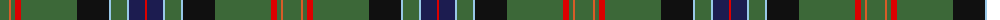

The parent of this is [New York Caledonian Club Day](/tartans/g/18/do2/g4/r6/g56/k32/lb2/g16/lb2/db16/r/2/)

This was sourced from register-of-tartans.  It is a [11 stripes tartan](/stripes/stripes11/).

Original link https://www.tartanregister.gov.uk/tartanDetails.aspx?ref=11280

## Thread count
G/18 DO2 G4 R6 G56 K32 LB2 G16 LB2 DB16 R/2

## Palette
Each colour and its ΔE from the base-6 reference it is a variant of.

| Colour | Shade | Base | ΔE (OKLab) |
|---|---|---|---|
| DB |  `#1C1C50` | B  | 0.14 |
| DO |  `#D85C28` | R  | 0.12 |
| G |  `#3C6838` | G  | 0.07 |
| K |  `#101010` | K  | 0.17 |
| LB |  `#98C8E8` | W  | 0.17 |
| R |  `#DC0000` | R  | 0.04 |

ID: /variants/g/18/do2/g4/r6/g56/k32/lb2/g16/lb2/db16/r/2-db1c1c50-dod85c28-g3c6838-k101010-lb98c8e8-rdc0000/
