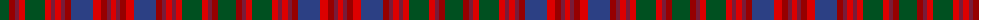

The parent of this is [Unidentified #35](/tartans/g/18/dra6/dr4/r6/g20/r6/dr4/r6/dr4/dra6/b22/r8/dra6/dr4/r/5/)

This was sourced from register-of-tartans.  It is a [15 stripes tartan](/stripes/stripes15/).

Original link https://www.tartanregister.gov.uk/tartanDetails.aspx?ref=4236

## Thread count
G/18 DRa6 DR4 R6 G20 R6 DR4 R6 DR4 DRa6 B22 R8 DRa6 DR4 R/5

## Palette
Each colour and its ΔE from the base-6 reference it is a variant of.

| Colour | Shade | Base | ΔE (OKLab) |
|---|---|---|---|
| B |  `#2C4084` | B  | 0.00 |
| DR |  `#781C38` | R  | 0.17 |
| DRa |  `#960000` | R  | 0.11 |
| G |  `#005020` | G  | 0.08 |
| R |  `#DC0000` | R  | 0.04 |

ID: /variants/g/18/dra6/dr4/r6/g20/r6/dr4/r6/dr4/dra6/b22/r8/dra6/dr4/r/5-b2c4084-dr781c38-dra960000-g005020-rdc0000/
