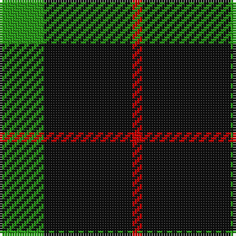

The parent of this is [Cowie, Justine (Personal)](/tartans/g/18/k36/r/4/)

This was sourced from tartans-authority.  It is a [3 stripes tartan](/stripes/stripes3/).

Original link http://www.tartansauthority.com/tartan-ferret/display/8555/

## Thread count
G/18 K36 R/4

## Palette
Each colour and its ΔE from the base-6 reference it is a variant of.

| Colour | Shade | Base | ΔE (OKLab) |
|---|---|---|---|
| G |  `#289C18` | G  | 0.18 |
| K |  `#101010` | K  | 0.17 |
| R |  `#C80000` | R  | 0.00 |

# Sample pattern

ID: /variants/g/18/k36/r/4-g289c18-k101010-rc80000/
