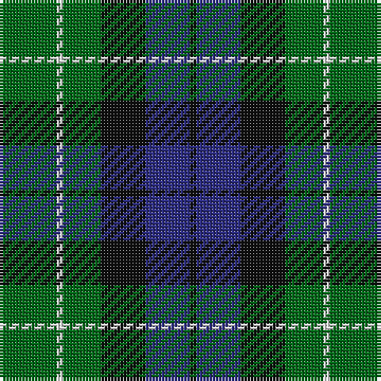

The parent of this is [Menteith District Tartan Tartan Number: 929. Earliest known date: Mid 19th century Menteith lies in the upper reaches of the River Forth. The tartan is similar to the Graham of Mentieth sett recorded by Logan in 1831. The proportions of colours are quite distinct, however, and the azure stipe in the family tartan is replaced by white in the district. The Menteith district tartan was rescued from oblivion in 1941 by Graeme Menteith who wrote to MacGregor-Hastie about it. (STS archives) See products available Copyright © Blair Urquhart, Comrie, 2015](/tartans/g/18/ln2/g12/k14/db14/k/2/)

This was sourced from house-of-tartan.  It is a [6 stripes tartan](/stripes/stripes6/).

Original link http://www.house-of-tartan.scotland.net/house/TartanViewjs.asp?colr=Def&tnam=929

## Thread count
G/18 LN2 G12 K14 DB14 K/2

## Palette
Each colour and its ΔE from the base-6 reference it is a variant of.

| Colour | Shade | Base | ΔE (OKLab) |
|---|---|---|---|
| DB |  `#2C2C80` | B  | 0.05 |
| G |  `#006818` | G  | 0.02 |
| K |  `#101010` | K  | 0.17 |
| LN |  `#E0E0E0` | W  | 0.06 |

# Sample pattern

ID: /variants/g/18/ln2/g12/k14/db14/k/2-db2c2c80-g006818-k101010-lne0e0e0/
