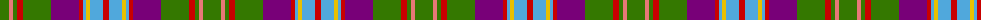

The parent of this is [Unidentified (Woven sample)](/tartans/g/18/lr4/g4/r6/g28/p28/r4/b3/y4/b13/r/6/)

This was sourced from tartans-authority.  It is a [11 stripes tartan](/stripes/stripes11/).

Original link http://www.tartansauthority.com/tartan-ferret/display/5862/

## Thread count
G/18 LR4 G4 R6 G28 P28 R4 B3 Y4 B13 R/6

## Palette
Each colour and its ΔE from the base-6 reference it is a variant of.

| Colour | Shade | Base | ΔE (OKLab) |
|---|---|---|---|
| B |  `#50A8DC` | W  | 0.29 |
| G |  `#347800` | G  | 0.07 |
| LR |  `#E87878` | R  | 0.19 |
| P |  `#780078` | B  | 0.16 |
| R |  `#C80000` | R  | 0.00 |
| Y |  `#E8C000` | Y  | 0.00 |

ID: /variants/g/18/lr4/g4/r6/g28/p28/r4/b3/y4/b13/r/6-b50a8dc-g347800-lre87878-p780078-rc80000-ye8c000/
