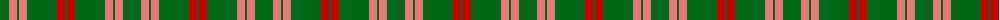
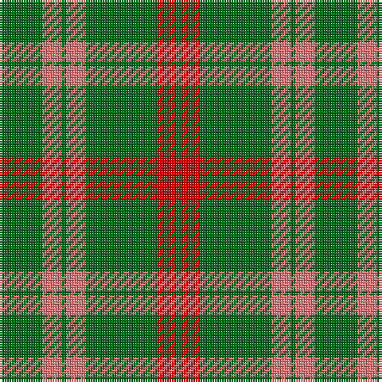

The parent of this is [Logan #4](/tartans/g/18/lr8/g2/lr8/g30/r8/g/2/)

This was sourced from register-of-tartans.  It is a [7 stripes tartan](/stripes/stripes7/).

Original link https://www.tartanregister.gov.uk/tartanDetails.aspx?ref=2184

## Thread count
G/18 LR8 G2 LR8 G30 R8 G/2

## Palette
Each colour and its ΔE from the base-6 reference it is a variant of.

| Colour | Shade | Base | ΔE (OKLab) |
|---|---|---|---|
| G |  `#006818` | G  | 0.02 |
| LR |  `#E87878` | R  | 0.19 |
| R |  `#C80000` | R  | 0.00 |

# Sample pattern

ID: /variants/g/18/lr8/g2/lr8/g30/r8/g/2-g006818-lre87878-rc80000/
