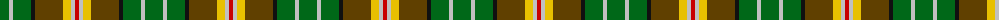
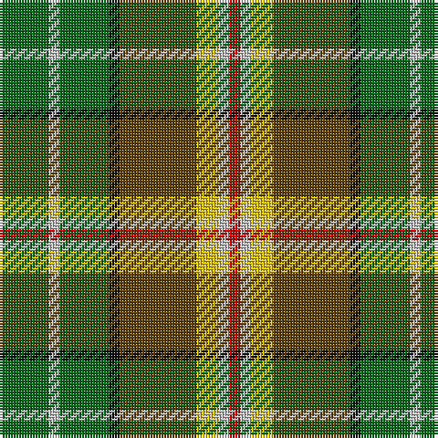

The parent of this is [McShane (Name)](/tartans/g/18/n4/g18/k4/t28/y8/n4/r/4/)

This was sourced from tartans-authority.  It is a [8 stripes tartan](/stripes/stripes8/).

Original link http://www.tartansauthority.com/tartan-ferret/display/4111/

## Thread count
G/18 N4 G18 K4 T28 Y8 N4 R/4

## Palette
Each colour and its ΔE from the base-6 reference it is a variant of.

| Colour | Shade | Base | ΔE (OKLab) |
|---|---|---|---|
| G |  `#006818` | G  | 0.02 |
| K |  `#101010` | K  | 0.17 |
| N |  `#C0C0C0` | W  | 0.16 |
| R |  `#C80000` | R  | 0.00 |
| T |  `#604000` | G  | 0.14 |
| Y |  `#E8C000` | Y  | 0.00 |

# Sample pattern

ID: /variants/g/18/n4/g18/k4/t28/y8/n4/r/4-g006818-k101010-nc0c0c0-rc80000-t604000-ye8c000/
