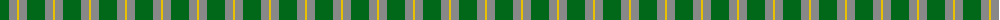
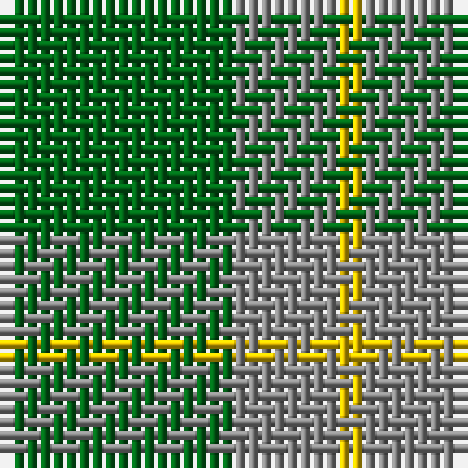

The parent of this is [Ledford Family Tartan Tartan Number: 835. Earliest known date: 1987 A quantity of this cloth was woven in 1998 for a Ledford family in the USA. See products available Copyright © Blair Urquhart, Comrie, 2015](/tartans/g/18/n8/y/2/)

This was sourced from house-of-tartan.  It is a [3 stripes tartan](/stripes/stripes3/).

Original link http://www.house-of-tartan.scotland.net/house/TartanViewjs.asp?colr=Def&tnam=835

## Thread count
G/18 N8 Y/2

## Palette
Each colour and its ΔE from the base-6 reference it is a variant of.

| Colour | Shade | Base | ΔE (OKLab) |
|---|---|---|---|
| G |  `#006818` | G  | 0.02 |
| N |  `#888888` | R  | 0.24 |
| Y |  `#E8C000` | Y  | 0.00 |

# Sample pattern

ID: /variants/g/18/n8/y/2-g006818-n888888-ye8c000/
