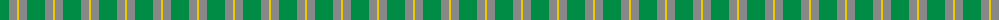
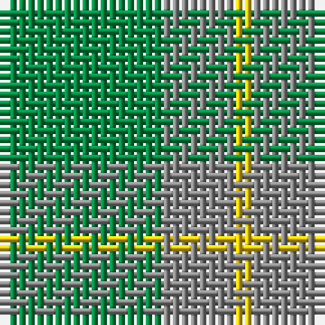

The parent of this is [Ledford (Name)](/tartans/g/18/n8/y/2/)

This was sourced from tartans-authority.  It is a [3 stripes tartan](/stripes/stripes3/).

Original link http://www.tartansauthority.com/tartan-ferret/display/835/

## Thread count
G/18 N8 Y/2

## Palette
Each colour and its ΔE from the base-6 reference it is a variant of.

| Colour | Shade | Base | ΔE (OKLab) |
|---|---|---|---|
| G |  `#008C44` | G  | 0.13 |
| N |  `#888888` | R  | 0.24 |
| Y |  `#F0C800` | Y  | 0.02 |

# Sample pattern

ID: /variants/g/18/n8/y/2-g008c44-n888888-yf0c800/
