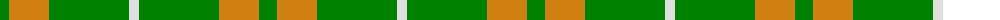

The parent of this is [O'Neill](/tartans/g/18/o40/g80/ln/10/)

This was sourced from weddslist.  It is a [4 stripes tartan](/stripes/stripes4/).

Original link http://www.weddslist.com/cgi-bin/tartans/pg.pl?source=sts

## Thread count
G/18 O40 G80 LN/10

## Palette
Each colour and its ΔE from the base-6 reference it is a variant of.

| Colour | Shade | Base | ΔE (OKLab) |
|---|---|---|---|
| G |  `#008000` | G  | 0.09 |
| LN |  `#E0E0E0` | W  | 0.06 |
| O |  `#D08010` | Y  | 0.17 |

# Sample pattern

ID: /variants/g/18/o40/g80/ln/10-g008000-lne0e0e0-od08010/
