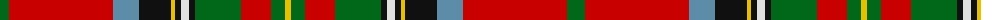

The parent of this is [Stewart of Galloway Clan Tartan Tartan Number: 851. Earliest known date: c.1820 Count taken from the specimen at the Smith Institute in Stirling. See products available Copyright © Blair Urquhart, Comrie, 2015](/tartans/g/18/r104/b26/k32/y4/k6/ln8/k6/g46/r30/g14/y/6/)

This was sourced from house-of-tartan.  It is a [12 stripes tartan](/stripes/stripes12/).

Original link http://www.house-of-tartan.scotland.net/house/TartanViewjs.asp?colr=Def&tnam=851

## Thread count
G/18 R104 B26 K32 Y4 K6 LN8 K6 G46 R30 G14 Y/6

## Palette
Each colour and its ΔE from the base-6 reference it is a variant of.

| Colour | Shade | Base | ΔE (OKLab) |
|---|---|---|---|
| B |  `#5C8CA8` | B  | 0.23 |
| G |  `#006818` | G  | 0.02 |
| K |  `#101010` | K  | 0.17 |
| LN |  `#E0E0E0` | W  | 0.06 |
| R |  `#C80000` | R  | 0.00 |
| Y |  `#E8C000` | Y  | 0.00 |

ID: /variants/g/18/r104/b26/k32/y4/k6/ln8/k6/g46/r30/g14/y/6-b5c8ca8-g006818-k101010-lne0e0e0-rc80000-ye8c000/
