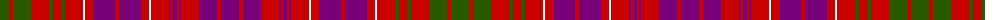

The parent of this is [Lumsden of Clova](/tartans/g/18/r4/g18/r18/g4/r8/g4/r18/w2/r8/p22/r4/p22/r8/w2/r18/p2/r2/p4/r2/p2/r18/p18/r4/p/18/)

This was sourced from register-of-tartans.  It is a [25 stripes tartan](/stripes/stripes25/).

Original link https://www.tartanregister.gov.uk/tartanDetails.aspx?ref=2246

## Thread count
G/18 R4 G18 R18 G4 R8 G4 R18 W2 R8 P22 R4 P22 R8 W2 R18 P2 R2 P4 R2 P2 R18 P18 R4 P/18

## Palette
Each colour and its ΔE from the base-6 reference it is a variant of.

| Colour | Shade | Base | ΔE (OKLab) |
|---|---|---|---|
| G |  `#285800` | G  | 0.04 |
| P |  `#780078` | B  | 0.16 |
| R |  `#C80000` | R  | 0.00 |
| W |  `#FCFCFC` | W  | 0.03 |

ID: /variants/g/18/r4/g18/r18/g4/r8/g4/r18/w2/r8/p22/r4/p22/r8/w2/r18/p2/r2/p4/r2/p2/r18/p18/r4/p/18-g285800-p780078-rc80000-wfcfcfc/
